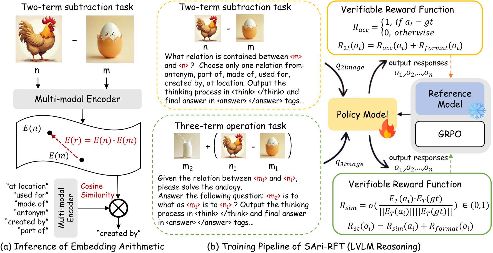
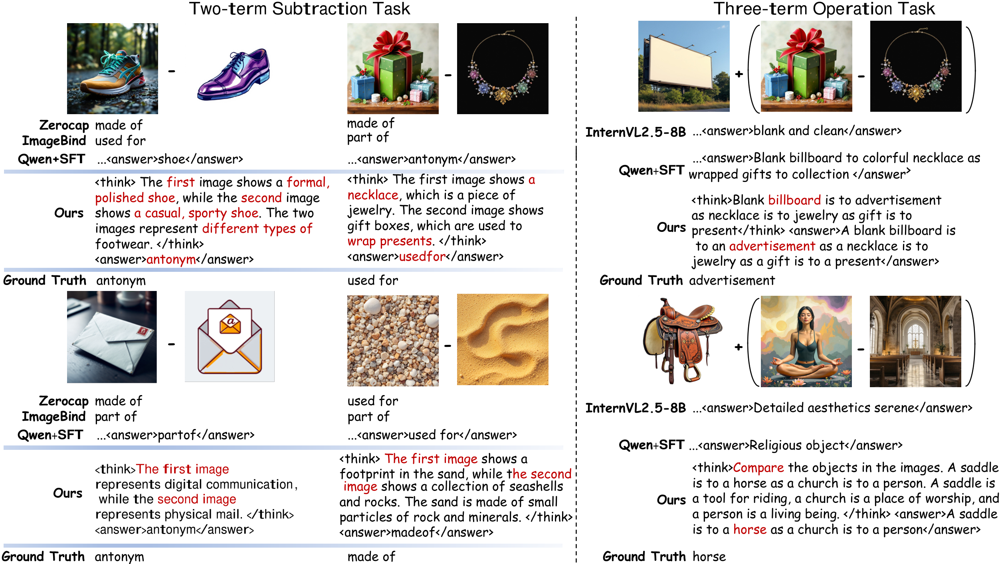
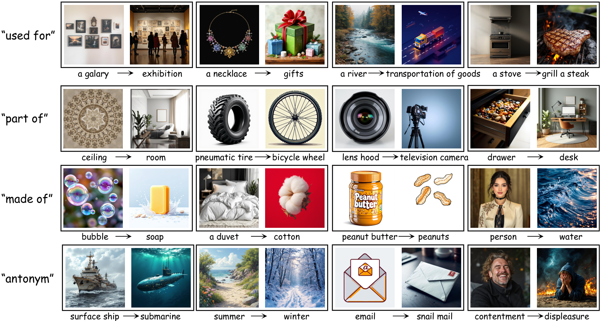

# Multi-modal Reasoning with LLMs for Visual Semantic Arithmetic

This repository studies **visual semantic arithmetic**: inferring **relations grounded in images** (e.g., “made of”, “used for”, “part of”, “antonym”) and solving **analogy-style** operations over visual concepts. Motivated by the classic text analogy “king − man + woman = queen”, we focus on the multimodal setting where images introduce commonsense requirements and distracting visual details.

## Overview
We formulate two tasks:
- **Two-term subtraction**: given a subject–object pair, predict the relation (multiple-choice).
- **Three-term operation**: given three terms, generate the missing term that completes the analogy.

We build **IRPD (Image-Relation-Pair Dataset)** for benchmarking and propose **SAri-RFT (Semantic Arithmetic Reinforcement Fine-Tuning)** to post-train LVLMs with **verifiable rewards** and **GRPO**.

## IRPD Dataset
- **IRPD (Google Drive)**: [download link](https://drive.google.com/drive/folders/1LJr9u1LBgSUnblfroRQ2sDd-6jPJoEqm?usp=sharing)
- **Dataset generation pipeline**: see `IRPD_dataset/`

## Code Structure
We provide four main directories:
- **`embedding_arithmetic/`**: baselines for embedding arithmetic (e.g., ZeroCap, ImageBind, LanguageBind).
- **`evalution/`**: evaluation code for IRPD and Visual7W-Telling.
- **`IRPD_dataset/`**: IRPD dataset generation pipeline.
- **`sari_rft/`**: SAri-RFT training methods, including GRPO for two tasks and SFT.

## Figures
### IRPD generation pipeline


### Qualitative / results visualization


### Flux dataset illustration


## Quick Start
Please refer to the subdirectories above for task-specific scripts and instructions. Typical workflow:
- **Dataset**: prepare IRPD (or your custom relation folders) and place paths in the corresponding scripts.
- **Training**: run SAri-RFT under `sari_rft/` (GRPO/SFT).
- **Evaluation**: run evaluation under `evalution/`.

## Citation
If you use this codebase/dataset, please cite (placeholder):

```bibtex
@misc{vis_arithmetic_2026,
  title        = {Multi-modal Reasoning with LLMs for Visual Semantic Arithmetic},
  author       = {TBD},
  year         = {2026},
  howpublished = {\url{https://github.com/xcooool/vis_arithmetic}},
  note         = {IRPD dataset link: LINK_TBD}
}
```

## Acknowledgement
We sincerely thank [Visual-RFT](https://github.com/Liuziyu77/Visual-RFT) and [ZeroCap](https://github.com/YoadTew/zero-shot-image-to-text) for their open-source resources.
